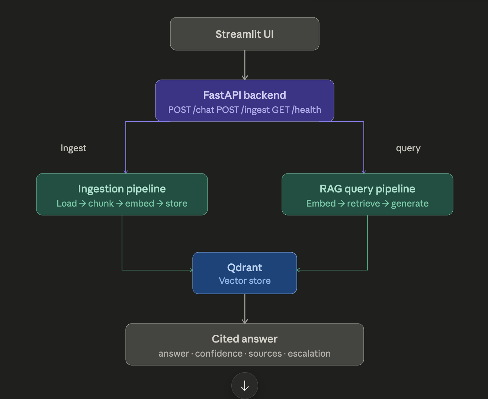

# OpsAssist AI

**OpsAssist AI** is a lightweight RAG-based engineering support assistant that answers troubleshooting questions from technical documentation with citations.

## Overview

OpsAssist AI helps engineering teams troubleshoot operational issues by retrieving relevant technical documentation, generating grounded answers using a local LLM, and returning cited source documents.

The project starts with a simple RAG core and is designed to grow into a secure support copilot with knowledge connectors, agentic workflows, evaluation, and optional desktop UI support.

## Architecture




## Features

* FastAPI backend
* Qdrant vector database
* LangChain-based document ingestion and retrieval
* Local LLM inference using Ollama
* Synthetic engineering documentation
* Cited answers with source metadata
* Basic health and retriever tests

## Tech Stack

| Component             | Tool                                   |
| --------------------- | -------------------------------------- |
| Language              | Python                                 |
| Dependency Management | uv                                     |
| Backend               | FastAPI                                |
| RAG Framework         | LangChain                              |
| Vector Database       | Qdrant                                 |
| Embeddings            | sentence-transformers/all-MiniLM-L6-v2 |
| Local LLM             | Ollama                                 |
| Model                 | llama3.1.                              |
| Testing               | Pytest                                 |
| Infrastructure        | Docker Compose                         |

## Project Structure

```text
opsassist-ai/
├── app/
│   ├── config.py
│   ├── ingestion.py
│   ├── main.py
│   ├── rag_pipeline.py
│   ├── retriever.py
│   └── schemas.py
├── data/
│   └── docs/
├── docs/
│   └── assets/
│       └── architecture.png
├── frontend/
├── scripts/
├── tests/
├── docker-compose.yml
├── pyproject.toml
├── uv.lock
└── README.md
```

## Common Commands

| Command | Description |
|---|---|
| `make install` | Install dependencies |
| `make dev` | Start Qdrant |
| `make ingest` | Ingest documentation into Qdrant |
| `make backend` | Start FastAPI backend |
| `make frontend` | Start Streamlit UI |
| `make eval` | Run retrieval evaluation |
| `make test` | Run tests |
| `make stop` | Stop Docker services |

## Setup

### 1. Install dependencies

```bash
uv sync
```

### 2. Create environment file

```bash
cp .env.example .env
```

### 3. Start Qdrant

```bash
docker compose up -d
```

Qdrant dashboard:

```text
http://localhost:6333/dashboard
```

### 4. Start Ollama

```bash
ollama serve
```

In another terminal:

```bash
ollama pull llama3.1
```

### 5. Ingest documents

```bash
uv run python -m scripts.ingest_docs
```

### 6. Run backend

```bash
uv run uvicorn app.main:app --reload
```

Health check:

```bash
curl http://localhost:8000/health
```

### 7. Ask a question

```bash
curl -X POST http://localhost:8000/chat \
  -H "Content-Type: application/json" \
  -d '{
    "question": "Why is the API Gateway returning 502 errors after release v2.3.1?",
    "top_k": 3
  }'
```

## Example Use Case

User question:

```text
Why is the API Gateway returning 502 errors after release v2.3.1?
```

Expected behavior:

* Retrieve API Gateway runbook
* Retrieve release notes for v2.3.1
* Retrieve Auth Service latency guide
* Generate a grounded troubleshooting answer
* Return cited source documents

## API Endpoints

| Endpoint  | Method | Description                    |
| --------- | ------ | ------------------------------ |
| `/health` | GET    | Backend health check           |
| `/chat`   | POST   | Ask a troubleshooting question |

## Roadmap

### v0.1 — RAG Core

* [x] FastAPI backend
* [x] Qdrant setup
* [x] Synthetic docs
* [x] Document ingestion
* [x] Retriever
* [x] Ollama-based answer generation
* [x] Streamlit UI
* [x] Basic retrieval evaluation

### v0.2 — Knowledge Connectors

* [ ] Ticket connector
* [ ] Log connector
* [ ] Service status connector
* [ ] Release metadata connector

### v0.3 — Agentic Workflow

* [ ] LangGraph triage workflow
* [ ] Intent classification
* [ ] Evidence aggregation
* [ ] Safety validation
* [ ] Escalation decision

### v1.0 — Portfolio Hardening

* [ ] Evaluation report
* [ ] CI/CD with GitHub Actions
* [ ] Dockerized API and frontend
* [ ] Optional PyQt desktop client
* [ ] Architecture and security documentation

## Design Principles

* Start with a reliable RAG core
* Keep answers grounded in retrieved context
* Return citations for every answer
* Use local-first infrastructure where possible
* Add agents only after retrieval quality is stable
* Keep future connectors read-only by default
